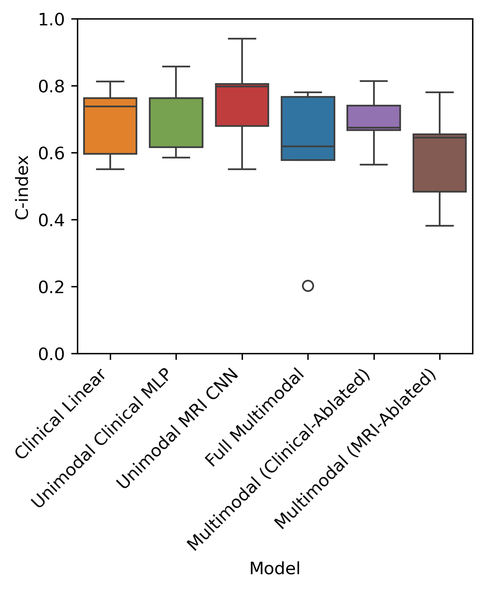
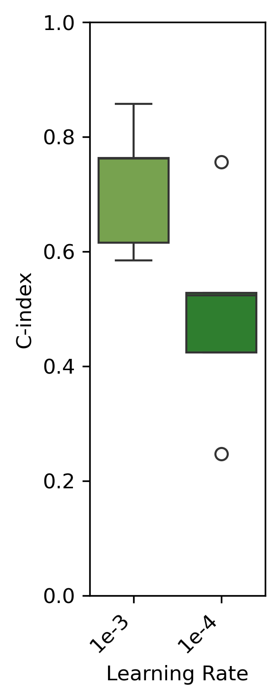
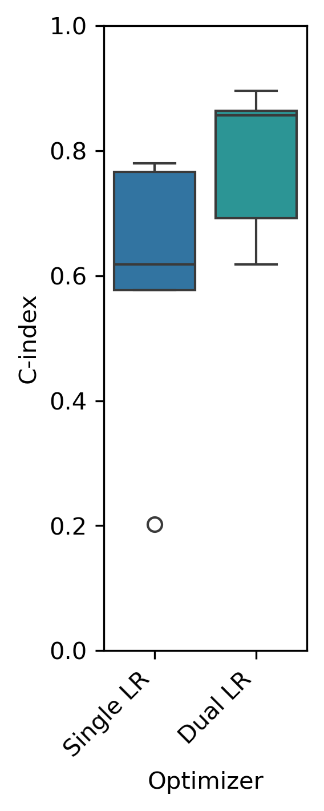

# Multimodal Prostate Cancer Recurrence Prediction

# Overview
This github repo assesses a multimodal architechture to integrate multiparametric MRI volumes and clinical tabular data. Please read the attached "Techincal_Report.pdf" for further details

# Models
Please find available models here:

https://huggingface.co/safwat08/prostate_cancer_recurrence_prediction

To replicate the models and results please follow the instructions below

# Datasets and Files
Please download the files from the google drive link
https://drive.google.com/drive/folders/1lrCNjbTuUtklUgmIxIN9gfCyEYdOM45e?usp=drive_link

# Environment / Requirements
Environment was handled using mamba 

Create and activate the environment using environment.yml
```bash
mamba env create -n <env_name> -f environment.yml
mamba activate <env_name>
```

# Preprocessing
Create clinical_data.csv from the raw clinical JSON files: 

```bash
python -m src.get_clinical.data
```

This merges all the json files for the clinical patients and produces a "clinical_data.csv" file

# Training and Inference
The scripts below will:

Save per-fold predictions in predictions/

Save the best model by validation C-index per fold in models/

Save per-fold C-index values in results/

## 1. Clinical Linear Model 
Description: Regularized Cox proportional hazards model using clinical data

```bash
python -m src.train_clinical_linear
```

## 2. Clinical MLP
Description: Fully connected neural network using clinical data. Learning rate 1e-3

```bash
python -m src.train --clinical_mlp
```

## 3. MRI CNN
Description: 3D CNN trained on full MRI volumes (ADC, HBV, T2W + mask channel). Preprocessing includes mask as a seperate channel


## 4. Full Multimodal Model
Description: Multimodal model integrating Clinical MLP backbone to process clinical data and MRI CNN backbone to process MRI volumes. Feature embeddings from each branch passed through a risk prediction MLP

```bash
python -m src.train --multimodal_model_full
``` 

## 5. Multimodal Model — MRI Ablated
Description: Multimodal model with MRI CNN branch ablated

```bash
python -m src.train --mutlimodal_model_mri_ablated
``` 

## 6. Multimodal Model — Clinical Ablated
Description: Multimodal model with Clinical MLP branch ablated

```bash
python -m src.train --mutlimodal_model_clinical_ablated
``` 

## 7. Clinical MLP - Learning Rate 1e-4
Description: Fully connected neural network using clinical data (Same as #2) but with a Learning rate 1e-4

```bash
python -m src.train.py --clinical_mlp_model_lr1e_4
``` 

## 8. MRI CNN - Precropped
Description: 3D CNN trained on full MRI volumes (ADC, HBV, T2W). However, channels cropped using T2W-mask prior to concatinating into 1 tensor. 

```bash
python -m src.train --mri_cnn_model_precropped
``` 

## ⭐ 9. Full Multimodal Model (Dual Learning Rate Optimizer)
Description: Same as #4 but uses a dual learning-rate optimizer (higher LR for the clinical MLP, lower LR for the MRI CNN) to balance learning between modalities.

**The strongest-performing variant across all folds**

```bash
python -m src.train --multimodal_model_full_diff_lr
```

# Summarize Results
Summarize model performance and predictions:
```bash
python -m src.merge_csv
```
This generates:

1. cindex_per_fold.csv - Contains the C-index values for the best models per fold 
2. prediction_results_per_model.csv - Contains the patient_id, risk score, event and time-to-event/censoring for the validation dataset for the best model per fold  

Conduct wilcoxon rank signed test on the C-index values 
```bash
python -m src.stats
```

# Visualization:
Recreate the figures used in the report:
```bash
python -m src.make_figures
```

# Results
C-index across models. 



C-index for the Clinical MLP model for different learning rates.



C-index of the Full Multimodal Model under different optimizer learning-rate configurations.



C-index for the unimodal MRI CNN model using different preprocessing strategies.


